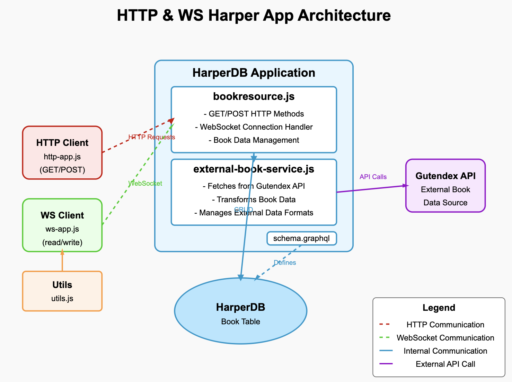

# HTTP & WS Harper App

This repository demonstrates a HarperDB application that showcases both HTTP (REST) and WebSocket (WS) interfaces for interacting with a database of books. You can perform CRUD operations via HTTP calls or exchange data in real time via WebSockets, all powered by a custom Harper resource and an external book service.

## Introduction
HTTP & WS Harper App is a sample project showing how to:

- Define a custom Harper resource (`bookresource.js`) to handle REST endpoints (`GET`, `POST`) and WebSocket connections (`connect` method).
- Maintain a GraphQL schema (`schema.graphql`) for the Book table.
- Separate external API logic into `external-book-service.js`, which fetches data from the [Gutendex API](https://gutendex.com/) and transforms it.
- Interact with the app using both HTTP and WS clients (`http-app.js` and `ws-app.js`).



## Setup Guide
1. Install Harper (or use the CLI if already installed). You can do that by running:
    ``` bash
    npm install -g harperdb
    ```
    To see more getting started docs, go to the [official Harper docs](https://docs.harperdb.io/docs/getting-started). 

2. Clone/Download this repo:
    ```bash
    git clone https://github.com/AdoraNwodo/ws-http-harper-app.git
    cd ws-http-harper-app
    ```

3. Install Dependencies:
    ```bash
    npm install
    ```
    This installs necessary packages (like `node-fetch`, `ws`, etc.).

4. Environment Variables (.env):
    - Copy `.env.example` to `.env` and adjust values if needed (e.g., for endpoints or environment-specific settings).
    - Ensure `.env` is listed in `.gitignore` so it’s not committed to version control.

5. Run Harper in Dev Mode:
    ```bash
    harperdb dev .
    ```
    This command tells Harper to treat the current directory as an application and load it. Harper will create (or update) the `Book` table based on `schema.graphql`, and load `bookresource.js` as a custom resource.

6. Run the Clients (in separate terminals):

- HTTP Client: `node client/http-app.js`
- WS Client: `node client/ws-app.js`

Each client will periodically send requests to illustrate real-time usage of HTTP and WS interfaces.

## Directory Structure
Below is a simplified view of the project files and folders:
```bash 
├── client
│   ├── http-app.js           // HTTP client (sends GET/POST requests)
│   ├── utils.js              // Helper functions (random data, IDs)
│   └── ws-app.js             // WebSocket client (sends read/write actions)
├── tests                     // Tests
│   └── external-book-service.test.js
├── .env.example              // Example environment variables file
├── .gitignore                // Ignores .env, node_modules, etc.
├── babel.config.js (or .cjs) // Babel configuration (if using ES modules & Jest)
├── config.yaml               // HarperDB application config (optional)
├── external-book-service.js  // Handles all Gutendex API calls
├── bookresource.js           // Custom HarperDB resource (REST & WS)
├── package.json              // Project manifest (scripts, dependencies)
├── package-lock.json         // Auto-generated lockfile
├── README.md                 // This README file
└── schema.graphql            // GraphQL schema defining the Book table

```

## About `external-book-service.js`
This file encapsulates all external API logic, specifically calls to the Gutendex API. The key methods are:
- `fetchExternalBookById(id)`: Fetches a single book from Gutendex, transforming its formats object.
- `fetchAllExternalBooks()`: Fetches all books, returning an array of transformed book objects.
- `transformFormats(book)`: Converts the `formats` object into an array of `{ key, value }` pairs.

By isolating external calls in this service, `bookresource.js` will be focused on HarperDB logic, making the code more modular and easier to test.

## About `bookresource.js`
`bookresource.js` is where the core application logic resides. It:

- Extends the `tables.Book` resource provided by Harper (via the GraphQL schema).
- Implements two REST methods:
    - `async get()` - Handles HTTP GET requests (fetch a single book by ID or all books if no ID).
    - `async post(data)` - Handles HTTP POST requests to create a new Book record.
- Overrides `async *connect(incomingMessages)` to handle WebSocket connections:
    - Reads incoming messages (`action: "write"` or `action: "read"`)
    - Writes new data to `Harper` or reads existing data from `Harper` (and possibly from the Gutendex API if not found locally in the Harper DB).

Within `bookresource.js`, there are helper methods to call the Gutendex API, transform external data formats, and merge external and local data.

## The WS Part & Running `ws-app.js`
### WS Logic in `bookresource.js`
When a WebSocket client connects (e.g., `ws://localhost:9926/Books`), Harper calls `connect(incomingMessages)` in `bookresource.js`.

- Incoming messages are parsed for an `action`.
- If `action` is `"write"`, a new record is created.
- If `action` is `"read"` with an `id`, it fetches a single record from the Harper DB or Gutendex.
- If `action` is `"read"` without an `id`, it fetches and merges all local and external books.

### Running `ws-app.js`
1. Open a new terminal in the project directory and run `node client/ws-app.js`
2. This WS client will:
    - Connect to `ws://localhost:9926/Books`
    - Every 10 seconds, send a `"write"` action with randomly generated book data.
    - Every 15 seconds, send a `"read"` action for all books.
    - Every 20 seconds, send a `"read"` action for a random Gutendex ID.

Check the console for logs showing messages sent and responses received from the server.

## The HTTP Part & Running `http-app.js`
### HTTP Logic in `bookresource.js`
The REST endpoints are automatically exposed by Harper:

- `GET http://localhost:9926/Books/` - Returns all Book records (plus external data).
- `GET http://localhost:9926/Books/:id` - Returns a single Book record or fetches from Gutendex if not found locally.
- `POST http://localhost:9926/Books` - Creates a new Book record.

### Running `http-app.js`
1. Open a new terminal in the project directory and run `node client/http-app.js`
2. This HTTP client will:
    - Every 10 seconds, send a `POST` request with random data to create a new book.
    - Every 15 seconds, send a `GET` request to fetch all books.
    - Every 20 seconds, send a `GET` request for a random Gutendex ID (e.g., `/Books/25344`).

Watch the console logs to see the requests and responses.

## Tests
Here, **Jest** is used for testing. The `tests/` folder contains:
- `external-book-service.test.js`: Unit tests for `external-book-service.js`.

To run tests:
```bash
npm test
```

If you’re using ES modules and Babel, ensure your `babel.config.js` or `babel.config.cjs` is properly set up, and your package.json includes `"type": "module"` or the correct transforms.

## Environment Variables
Here, [dotenv](https://www.npmjs.com/package/dotenv) is used for environment variables in development. A `.env.example` file is provided. Copy it to `.env` and fill in any required values. Make sure `.env` is in `.gitignore` to avoid committing sensitive data.

In production, set environment variables via your deployment platform (e.g., Docker, cloud provider). This keeps your configuration flexible and secure.


## Thank you for sticking to the end 💜 ✨